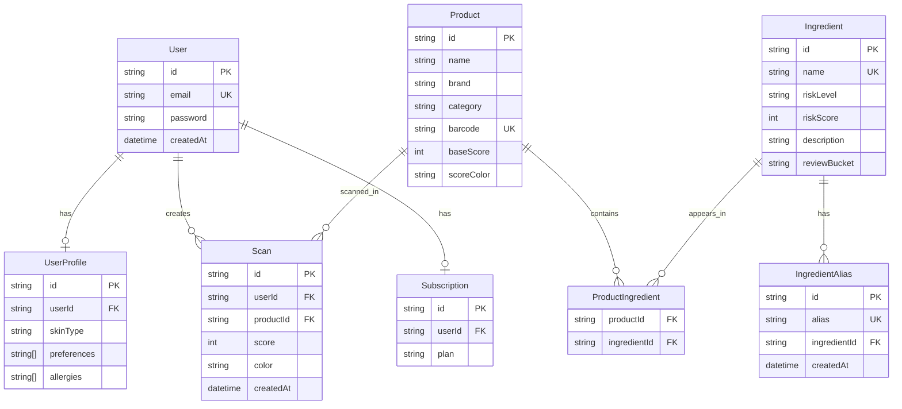
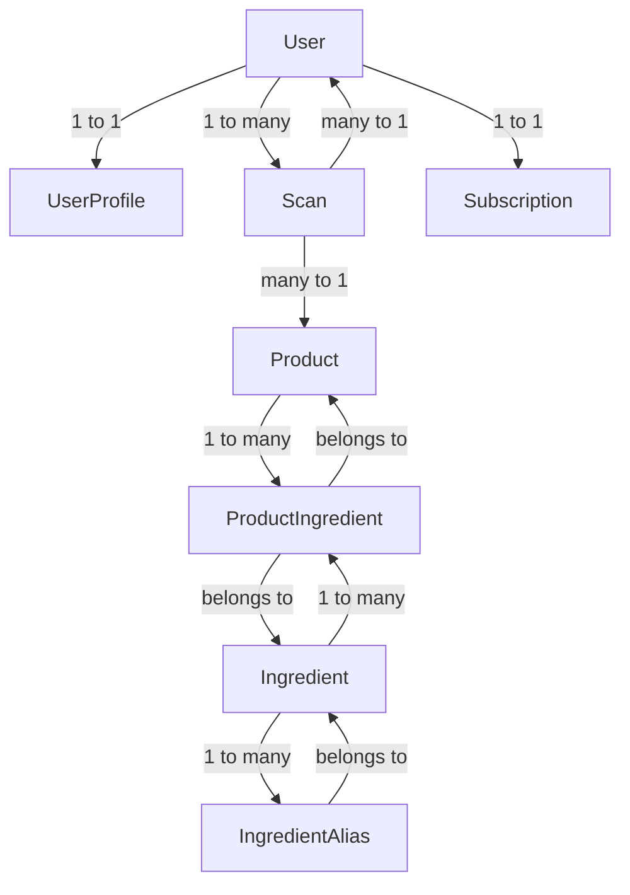

# AI Beauty Product Scanner
## Overview

```
AI Beauty Product Scanner is a mobile-first web application that helps users understand what is inside their beauty and skincare products. By scanning or searching a product, users receive a safety score, ingredient breakdown, and AI-generated explanations to help them make better decisions.
```

```
This project was built as a capstone with the goal of creating a real-world, scalable product that goes beyond basic ingredient checkers by adding personalization, comparison tools, and AI-driven insights.
```

# Problem

## Most consumers do not fully understand the ingredients listed on beauty products. Existing tools often:

- use generic scoring systems
- lack clear explanations
- do not account for user-specific sensitivities
- provide little to no comparison between products

**This leads to confusion and poor decision-making when choosing products.**

# Solution

## This application provides a simple workflow:

- Scan or search a product
- Analyze ingredients using a structured dataset
- Generate a safety score (green, yellow, red)
- Explain results in plain language
- Recommend safer alternatives

**The goal is to make ingredient transparency easy and actionable.**

# Features
## Core Features
- Product search and lookup
- Ingredient-based scoring system
- Color-coded safety results
- AI-powered explanations
- Product comparison (side-by-side)
- Advanced Features (in progress)
- OCR label scanning
- Personalized scoring based on user profile
- Ingredient alerts (allergens, preferences)
- Scan history and saved products
- AI recommendations for safer alternatives

# Tech Stack
## Frontend
Next.js (App Router)
React
Tailwind CSS
Backend
Next.js API routes
Prisma ORM
Database
PostgreSQL (Vercel Postgres)
AI & Processing
OpenAI API (explanations and recommendations)
OCR (planned: Google Vision / Tesseract)
Database Design

# The system is built around a normalized ingredient model:

- Products contain many ingredients
- Ingredients can appear in many products
- Ingredient aliases normalize real-world label variations
- Scans store user interactions and results

**This structure allows accurate matching and scalable analysis.**

# Scoring Model

## Each ingredient is assigned:

- risk level (low, moderate, high)

# risk score

**The product score is calculated by subtracting ingredient risk from a base score of 100.**

### Score ranges:

**80–100 → Green (safe)**
**50–79 → Yellow (moderate concern)**
**Below 50 → Red (high concern)**

## Required Environment Variables

Copy [`.env.example`](/Users/taylorpoe/Projects/Beauty_Ingreditent_Scanner/.env.example) to `.env.local` for local development and set the same values in Vercel:

- `DATABASE_URL`
- `AUTH_SECRET`
- `OPENAI_API_KEY`

## Local Development

```bash
npm install
npm run db:generate
npm run dev
```

## Database Commands

```bash
npm run db:migrate
npm run db:migrate:deploy
npm run db:seed
```

## Production Build

```bash
npm run build
npm run start
```

## Vercel Deployment

1. Import the repository into Vercel.
2. Set `DATABASE_URL`, `AUTH_SECRET`, and `OPENAI_API_KEY` in the Vercel project settings.
3. Use the default build command: `npm run build`.
4. If you are using Prisma migrations in production, run `npm run db:migrate:deploy` against the production database before or during deployment.

## Current Notes

- `/api` is a simple health check endpoint.
- `/api/scans` currently returns mock OCR output until a production OCR provider is wired in.
- Product detail pages now fetch data directly from Prisma instead of relying on a localhost-only API call.





