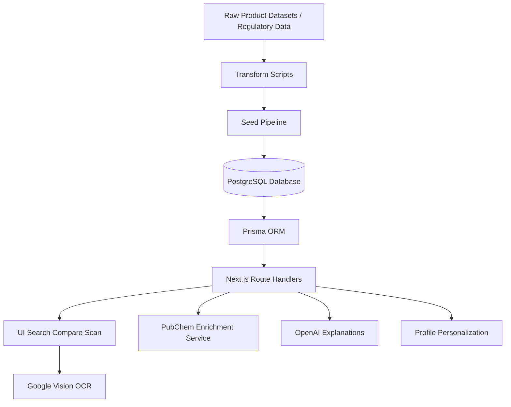
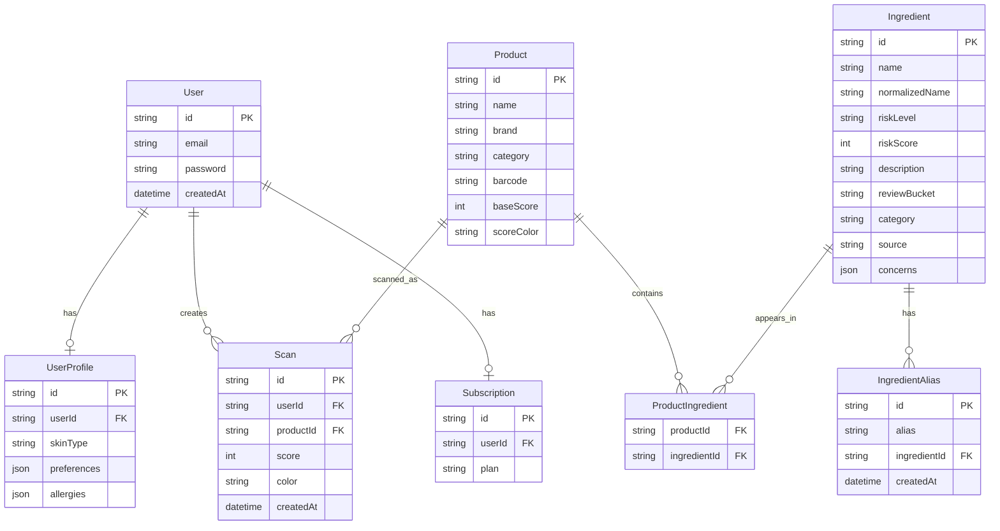

# InciSight
## By Taylor Poe, Jacob Griffith, & Alfredo Rosado

> Scan • Understand • Decide
> A full-stack ingredient intelligence app for beauty and skincare products.

## Overview

InciSight helps users understand cosmetic ingredient lists in a more practical way than a simple red/yellow/green score. The app combines a seeded product catalog, ingredient-level risk data, OCR, database-backed search, product comparison, and AI-generated explanations.

The project started as a capstone, but the codebase is structured like a real product:

- guest and signed-in user flows
- database-backed product and ingredient search
- OCR-powered ingredient scanning
- structured ingredient matching and scoring
- grounded AI explanations with fallback behavior
- profile-based personalization
- optional PubChem enrichment for imported ingredients

## Quick Start

For the fastest local setup:

```bash
npm install
npm run db:push
npm run db:seed
npm run dev
```

Then open:

- `http://localhost:3000`

Optional PubChem enrichment after the main app is working:

```bash
python3 -m venv .venv
source .venv/bin/activate
python3 -m pip install fastapi uvicorn httpx
python3 -m uvicorn pubchem_service:app --host 127.0.0.1 --port 8000
npm run db:enrich:pubchem
```

## What The App Does

Users can:

- search products from the catalog
- open product detail pages
- scan ingredient labels with OCR
- compare products side by side
- view flagged ingredients and score breakdowns
- get AI explanations grounded in stored ingredient metadata
- continue as a guest or sign in for profile-based personalization

Signed-in users can additionally:

- save profile settings
- store skin type, preferences, and allergies
- receive explanation notes tailored to their profile
- get allergy-aware alerts when there is a direct match

## Core Features

- Product search with dropdown suggestions
- Product details with ingredient breakdowns
- Product comparison API and UI
- OCR ingredient scanning with Google Vision
- Ingredient parsing and normalization
- Ingredient-to-database matching
- Rule-based product scoring
- AI explanation generation using OpenAI
- Personalized explanation focus areas for signed-in users
- Guest mode support
- Account creation and sign-in with Auth.js / NextAuth credentials
- Packaging-signal scan support
- PubChem enrichment for imported ingredients
- COSING Annex II / EU banned ingredient source data in the seed pipeline

## Tech Stack

### Frontend

- Next.js 16
- React 19
- TypeScript
- Tailwind CSS 4

### Backend

- Next.js App Router
- Next.js Route Handlers
- Node.js
- Zod for validation

### Authentication

- Auth.js / NextAuth v5 beta
- Credentials-based sign-in
- bcryptjs password hashing

### Database / ORM

- PostgreSQL
- Prisma ORM
- `@prisma/adapter-pg`
- Neon Postgres on Vercel is the current recommended database target

### AI / OCR / Enrichment

- OpenAI API for grounded AI explanations
- Google Cloud Vision for OCR
- PubChem local FastAPI service for ingredient enrichment
- Custom TypeScript enrichment/import scripts

### Data Pipeline

- TypeScript transform scripts for imported datasets
- JSON seed pipeline for ingredient and product data
- COSING Annex II transformation pipeline
- Optional PubChem enrichment pass after seeding

### Deployment

- Vercel

## Data Sources

The repository currently references and/or derives data from:

- BeautyFeeds.io product datasets
- PubChem
- NIH-linked ingredient information used in enrichment workflows
- EU COSING Annex II banned ingredient data

## Repository Structure

High-level directories and key files:

- `app/` — Next.js pages, route handlers, and UI components
- `lib/` — shared server/client helpers, auth, Prisma, scoring, AI explanation logic
- `prisma/` — Prisma schema, seed script, enrichment scripts
- `data/` — transformed ingredient and product seed data
- `data/raw/` — raw import inputs
- `pubchem_service.py` — local FastAPI service used by PubChem enrichment
- `scripts/` — dataset transformation utilities

## Environment Variables

At minimum, local development typically needs:

```env
DATABASE_URL=
AUTH_SECRET=
OPENAI_API_KEY=
GOOGLE_APPLICATION_CREDENTIALS=
PUBCHEM_SERVICE_URL=http://127.0.0.1:8000
```

The app also supports Vercel-style Postgres env fallbacks:

- `POSTGRES_PRISMA_URL`
- `POSTGRES_URL`
- `DATABASE_POSTGRES_URL`
- `NEXTAUTH_SECRET` as a fallback for `AUTH_SECRET`

## Installation

### 1. Clone and install dependencies

```bash
git clone <your-repo-url>
cd InciSight
npm install
```

### 2. Configure environment variables

Create or update `.env.local` with your local settings.

For database setup, use a working Postgres connection string. This project was updated to work well with Neon / Vercel-managed Postgres-style env vars.

### 3. Initialize the database

Push the Prisma schema:

```bash
npm run db:push
```

Seed the database:

```bash
npm run db:seed
```

### 4. Start the app

```bash
npm run dev
```

Then open:

- `http://localhost:3000`

## PubChem Enrichment Setup

PubChem enrichment is optional. It improves imported ingredient metadata by adding synonyms and toxicity-related description text where matches are found.

### 1. Create a Python virtual environment

```bash
python3 -m venv .venv
source .venv/bin/activate
python3 -m pip install fastapi uvicorn httpx
```

### 2. Start the local PubChem service

```bash
python3 -m uvicorn pubchem_service:app --host 127.0.0.1 --port 8000
```

### 3. Make sure `.env.local` contains

```env
PUBCHEM_SERVICE_URL="http://127.0.0.1:8000"
```

### 4. Run enrichment in another terminal

```bash
npm run db:enrich:pubchem
```

## Dataset Import / Transform Commands

Available project scripts:

```bash
npm run data:excel
npm run data:excel:all
npm run data:cosing
```

Database scripts:

```bash
npm run db:generate
npm run db:push
npm run db:seed
npm run db:enrich:pubchem
```

Quality / build scripts:

```bash
npm run lint
npm run build
```

## How To Use The App

### Guest Flow

- Open the dashboard
- Search products
- Scan ingredient labels
- Compare products
- Read product explanations without saved personalization

### Signed-In Flow

- Create an account or sign in
- Open the dashboard
- Update profile settings
- Set skin type, preferences, and allergies
- Re-run scans and product views with personalized explanation notes

### Product Search

- Use the product search bar on the dashboard
- Select a product from the dropdown
- Open its product detail page

### Ingredient Scan

- Upload an ingredient label image
- Review parsed ingredients
- Review matched ingredients and score
- Read the AI explanation block

### Compare Products

- Open `/compare`
- Select two products
- Review scores, flagged ingredients, and summary result

## AI Explanation Notes

The explanation system is designed to be more grounded than a generic prompt-only summary.

It currently:

- uses stored ingredient metadata, risk level, score, concerns, and description
- supports structured explanation output
- falls back to rule-based explanations if AI is unavailable
- can personalize notes for signed-in users based on profile data

Guests still receive explanations, but without saved user-profile personalization.

## Database Notes

After switching to a fresh Postgres database:

- `npm run db:push` creates the schema
- `npm run db:seed` restores what the seed script knows how to import
- `npm run db:enrich:pubchem` optionally enriches imported ingredients further

Seed restores:

- ingredient records from local JSON datasets
- aliases
- starter/demo user and profile
- starter products
- imported product catalog JSON data
- product-to-ingredient relationships

Seed does not automatically restore:

- old user-created accounts from a previous unrelated database
- old scan history unless separately migrated
- any data that existed only in the old DB and not in the repository data files

## Team

- Taylor Poe — product direction, full-stack implementation, UI/UX, architecture, dataset integration
- Jacob Griffith — data pipeline work, PubChem integration, backend and enrichment support
- Alfredo Rosado — presentation, product planning, future AI workflow and interaction features

## Architecture



## ER Diagram



## Current Status

This README reflects the current codebase at a high level, including:

- guest + signed-in flows
- profile settings
- Auth.js credentials auth
- Prisma + Postgres / Neon setup
- OCR scan flow
- PubChem enrichment support
- AI explanation pipeline
